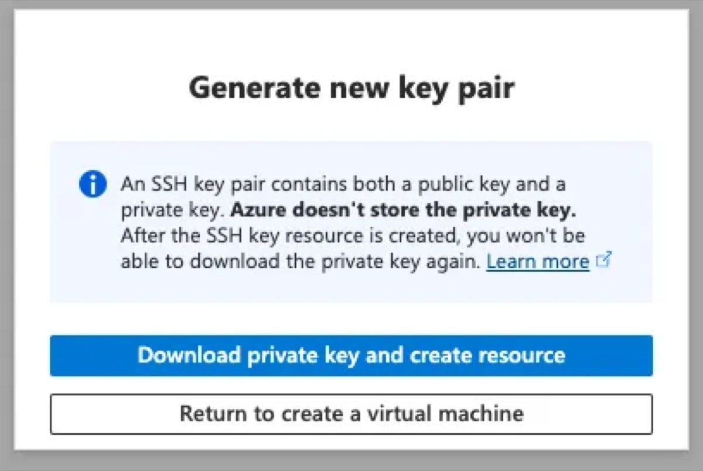
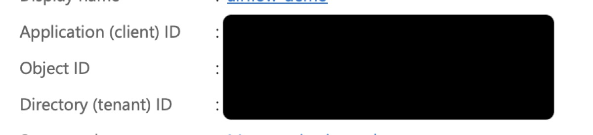

# Airflow-Azure-Starter
This repo is intended to help Airflow users get up and running on an Azure VM with the Airflow LocalExecutor.  This setup uses LocalExcutor as that is good for a single VM setup.  This setup can work for production workloads for small teams, but if/when scaling is an issue users should switch to the CeleryExecutor or KubernetesExecutor.  This repo will not demonstrate how to do that explicitly. However, many components about how to connect Airflow to Azure KeyVault and how to use Microsoft Entra ID OAuth will be covered and can be reused or modified for larger scale deployments.

## Requirements
- Microsoft Entra ID
- Azure Virtual Machine running Linux
- Airflow 3 running on Docker
- Caddy (as a reverse proxy and for HTTPS certification)

## Setting up the Azure Virtual Machine
1. Log in to the [Azure Portal](https://portal.azure.com/).
2. Navigate to **Virtual Machines** and click **Create**.
3. Choose a Linux image (e.g., Ubuntu 22.04 LTS).
4. Select a VM size appropriate for your workload.

5. Configure authentication (SSH key recommended).
6. Keep the default azureuser username if testing and change if ready for production.
7. Set up networking (allow inbound ports for SSH and HTTPS).

8. Assign a System Managed Identity to the VM.  This is the identity that will access Key Vault later on.

9. Review and create the VM.
10. Once the popup appears to Generate a new key Pair click Download private key.

11. Once the vm is created, click on "Overview" on the left.  In the Overview section find your Public IP Address and click on it.

12. Create a unique DNS label for your IP and note the extension in the bottom right. (The full url is needed for the App Registration later)

13. Return to the VM and click on Network Settings, under Network on the left.
14. Create a new port rule and select Inbound Port Rule.  Configure it to allow any source and have port 8080 as the destination port ranges.


The VM set up is complete for now. Next we set up the Entra App.


## Key Vault
Microsft has a good guide on how to create and connect a KeyVault to an Azure VM and I followed it to set up my key vault. Note that if the steps above to setup up the VM were followed then the VM already has a System Managed Identity assigned to it.

If you wish to test out if your key vault is connected to your VM and need to ssh into your VM, the command to do so is in the "Running Airflow on the VM" section below.

[Key Vault Guide](https://learn.microsoft.com/en-us/entra/identity/managed-identities-azure-resources/tutorial-linux-managed-identities-vm-access?pivots=identity-linux-mi-vm-access-key-vault)

Once the Key vault is created and you confirmed that it works, you need to add one of our first secrets to the vault.

Note if you don't have permission to create or view secrets you need to assign yourself permission to do so similarly as you did to grant the system managed identity for your Azure VM access to key vault.

1. Navigate to Objects in your vault. Click on Screts. Create a new secret named FERNET-KEY.
2. Run the below command to generate a fernet key to use as the value for your secret and save it as the secret value.
```bash
python -c "from cryptography.fernet import Fernet; print(Fernet.generate_key().decode())"
```


## Entra App Registration

1. Navigate to Microsoft Entra ID.  Click on App Registrations

2. Pick a name for your application and the appropriate Supported Account Type.  For Redirect URI select Web and fill it in with the DNS you came up with for the Azure VM + "/auth/oauth-authorized/azure"
```bash
https://<your-vm-dns>/auth/oauth-authorized/azure
```
Example URI:
`https://mycompanyairflow.eastus2.cloudapp.azure.com/auth/oauth-authorized/azure`


3. Once your App is created, navigate to your App Overview.  Copy the client and Tenant IDs and make secrets in your key vault for them labeled AAD-TENANT-ID and AAD-CLIENT-ID respectively.



4. Go back to your Entra App and under Manage click "Certificates and Secrets".

5. Click "New Client Secret"

6. Fill in a description for your secret and click create.


7. Once the secret is created immediately copy the Value (you won't be able to copy it later) of the secret and go the KeyVault. In your Keyvault, create a new secret called AAD-CLIENT-SECRET and paste the client secret value that you just copied in the Secret Value Section

8. Next Go back to your app and click on "App Roles"

9. Create 3 roles, for airflow users, viewers and admins.  Create other roles as needed. 


10. Enable optional and group claims in the Token configuration section of your app.


11. Navigate to the Entra ID portal. Click on Enterprise Apps and then the name of your Airflow app.  Then click on Users and Groups.

12. Click on add new user/group and select the appropriate users/groups and roles that you want them to have.


## Running Airflow on the VM

1. Open a terminal on your PC. CD into the directory where your ssh key is. connect to your VM using SSH:
    ```sh
    ssh -i <your-key-name>.pem  username@<your-vm-ip>
    ```
2. Follow the instructions on [this page](https://docs.docker.com/engine/install/ubuntu/) to install Docker on your VM.  
3. Install [Docker Compose](https://docs.docker.com/compose/install/) on your VM.
4. Install [Azure Cli](https://learn.microsoft.com/en-us/cli/azure/install-azure-cli-linux?view=azure-cli-latest&pivots=apt) if not installed when setting up KeyVault.
5. Install Git on the VM.
```bash
sudo apt update
sudo apt install git
```
6. Clone this repo into you VM.
```bash
sudo git clone https://github.com/RaphCodec/airflow-azure-starter
```

7. Run these commands to allow you to use docker, git, and own the files in the repo without needing to use sudo. Replace azureuser with your username. Then cd into the repo folder.

```bash
sudo chown -R azureuser:azureuser ~/airflow-azure-starter
sudo chmod -R u+rwx ~/airflow-azure-starter
```

```bash
sudo usermod -aG docker azureuser
```

After running the above command either log in and log out for the command to take effect or run the following.

```bash
newgrp docker
```

```bash
cd airflow-azure-starter
```

8. Create env variables for the KeyVault and Domain names. Add https:// before the dns name
```bash
export KEYVAULT_NAME='your-keyvault-name'
export DOMAIN_NAME='your-vm-dnsname'
```

9. Start Airflow by running the start airflow bash file. Once all the containers are running the Airflow UI may take 1-2 minutes to be available.
``` bash
chmod +x scripts/start_airflow.sh
```
``` bash
scripts/start_airflow.sh
```

10. Open a new browser on your personal PC and navigate to the DNS of your Azure VM (found on in the overview section of your Azure VM).  

11. Click on Sign in with Azure and Enjoy using Airflow!


## Setting Up GitHub Dag Bundle
This section goes over setting up Github as remote dag bundle for your Airflow Instance.
This exmaple uses deploy keys to connect your repo to airflow.

1. Run this command to generate a private key pair.
```bash
ssh-keygen -t ed25519 -f ~/.ssh/airflow_deploy_key -C "airflow-github" -N ""
```
2. In you GitHub repo navigate to Settings -> Deploy Keys and create and new Deploy Key.  Paster the PUBLIC key in the Key Section.

3. Replace the newline in the private key with \n and create an appropriately named connection in you airflow instance.
See the youtube video below for reference.


### Reference Links that helped me resolve issues
1. https://github.com/apache/airflow/discussions/48578
2. https://www.nextlytics.com/blog/implementing-single-sign-on-sso-authentication-in-apache-airflow
3. https://flask-appbuilder.readthedocs.io/en/latest/security.html
4. Redis over commit memory warning fix - https://aws.plainenglish.io/resolving-redis-memory-overcommit-must-be-enabled-error-4b4d32ac050c
5. https://www.youtube.com/watch?v=WjALlgE53dM ----- THIS IS FOR GIT DAG BUNDLES